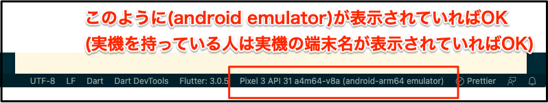
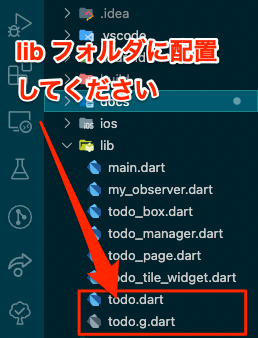

<!-- headingDivider: 1 -->

 
# Todoアプリハンズオン 
## by Flutter

pregum
 
# 目次

* 最初に
* Flutterとは？
* Flutterとネイティブアプリとの違い
* なぜ他のXPではなくFlutterなのか？:thinking:
* 今日作るアプリについて
* TodoApp作成
* (時間があれば)、質疑応答

---
### 最初に

今日はハンズオンに参加していただき、ありがとうございます。

1点お願いがあります。
サンプルのカウンターアプリが起動ができていない方は
話している最初の10~15分程度でサンプルのカウンターアプリの起動まで準備していただけますと
スムーズに進行できるかと思いますので、ご協力お願いします。

それではよろしくお願いします。

---
### 動作環境

Flutterのバージョン: 3.0.5

Flutterのバージョンは`flutter doctor -v`で確認できます。

Flutterのバージョンをいじりたくない場合は
`fvm`を入れてバージョンを固定しましょう.

`brew install fvm` コマンド実行後、今回の作業フォルダで`fvm local 3.0.5 -f`を実行すればOK

参考サイト: https://zenn.dev/riscait/articles/flutter-version-management

# Flutterとは？

* Googleが開発中のクロスプラットフォーム(以降XP)開発が可能なフレームワークです。
* 今現在(2022/8/22)、iOS/Android/Web/Linux/macOS/Windowが開発可能です。


---
## Flutterとネイティブアプリとの違い 

開発スピードと処理速度

項目|Flutter|ネイティブアプリ
:---:|:---:|:---:
パフォーマンス | 若干遅い | 早い
開発速度 | 概ね１Platform分 | OS数に応じて遅くなる
検討されるケース | 開発コスト削減 | nativeの機能が必要 


---
## なぜ他のXPではなくFlutterなのか？:thinking:

色々ありますが以下が大きな要因です。

<ul>
  <li>いい感じのUIが標準ライブラリで作れる</li>
  <li>アプリを起動しながらレイアウトの微調整が可能</li>
  <li>Debugツールが使いやすい</li>
  <li>対応プラットフォームが多い</li>
  <li>UIのソースがWeb上で共有できる(DartPad)</li>
</ul>

<!-- ---
<style scoped>
  .red-border {
    border: solid red;
  }
</style>
## なぜ他のXPではなくFlutterなのか？:thinking:

今回のハンズオンでは赤枠の部分を実際に体験できる箇所です。

<ul> 
  <li class="red-border"> いい感じのUIが標準ライブラリで作れる </li>
  <li class="red-border"> アプリを起動しながらレイアウトの微調整が可能 </li>
  <li class="red-border"> Debugツールが使いやすい </li>
  <li> 対応プラットフォームが多い </li>
  <li> UIのソースがWeb上で共有できる(DartPad) </li>
</ul> -->

---
## なぜ他のXPではなくFlutterなのか？:thinking:

### --> UIのソースがWeb上で共有できる(DartPad)

下記のurlからサンプルコードが実行可能

https://dartpad.dev/7942cc454f0937046632c7c61ea3e773 


---
## 実行結果

<style scoped>
  .middle-center {
    margin: 0 auto;
    width: 100%;
    object-fit: contain;
    /* background-color: red; */
  }
</style>


---
##  開発も全てDartPadで良いのでは:thinking:

<!-- ✅ UIレイアウトの共有が簡単(Code Penみたいに共有可能) -->
❌ 端末上では確認できない
❌ 複数ファイル必要な複雑なレイアウトは確認できない
❌ MySQLなどのDBや端末のセンサを使用するライブラリは使用不可

上記の点で実際の開発環境として使うのは厳しい 😓 

軽く挙動を見たい時に使うのが良さそう


---
<style scoped>
  .tes {
    width: 100%;
    justify-content: center;
    align-content: center;
    display: flex;
    height: 60vh;
    /* background-color: green; */
    text-align: center;
    line-height: 60vh;
  }
</style>

<h1 class="tes"> 今日作るアプリについて </h1>

---
## 今日作るアプリについて
#### 今日できるアプリ

https://github.com/Pregum/todo-app-hands-on-flutter

機能一覧

* タスク作成機能
* タスク編集機能
* タスク削除機能
* タスク完了チェック機能


---
## アプリを作り始める前に

#### FlutterのUIについて

FlutterのUIは全て**ウィジェット**

* テキスト
* ボタン
* チェックボックス
* etc...

---
### FlutterのUIについて
ウィジェットは大きく分けて2種類存在する

* **状態(State)を持つStateful Widget**
  * setState()で状態を変更可能
* **状態(State)を持たないStateless Widget**
  * setState()は使用不可
  * 親ウィジェットや外部から受け取るデータによって更新可能

最初はStateful Widgetを使っておけばOK:+1:

---
### Flutterは宣言的UI

<style scoped>
  .left {
    display: flex;
    width: 48%;
    flex-direction: column;
  }
  .center{
    display: flex;
    width: 4px;
    margin: 8px;
    background-color: black
  }
  .right {
    display: flex;
    width: 48%;
    flex-direction: column;
  }
  .container {
    display: flex;
    flex-direction: row;
    margin-top: 16px;
  }
</style>

<div class="container">
  <div class="left">

  ###### 宣言的UI (React, SwiftUI, etc...)

    String name = 'taro';

    Center(
      child: Text('Hello $name'),
    ),

    // -> Hello taro

  何を表示させるかを記述する。
  </div>

  <div class="center">
  </div>

  <div class="left">

  ###### 命令的UI (UIKit, WinForms, etc...)

    text.frame = CGRect(
      x: 50,
      y: 50,
      width: 50,
      height: 50
    )
    text.text = "taro"
    text.textAlignment = NSTextAlignment.Center

  レイアウトの配置からテキストの文字列まで記述する。
    
  </div>
</div>

---
### 一言で表すと

宣言的UIは**何をしたいかをコードで伝える** (What)

命令的UIは**どのようにしたいかをコードで伝える** (How)

---
## Flutterでの描画

どのウィジェットを使用する場合でもレイアウトは `build` メソッドに記述されています。

Text, ListView, Slider, Container, etc...
どのウィジェットでも`build` メソッドに記載されています。
レイアウトを確認したいときは`build` で検索すると良いです。

---

<style scoped>
  .left {
    display: flex;
    width: 48%;
    flex-direction: column;
  }
  .center{
    display: flex;
    width: 4px;
    margin: 8px;
    background-color: black
  }
  .right {
    display: flex;
    width: 48%;
    flex-direction: column;
  }
  .container {
    display: flex;
    flex-direction: row;
    margin-top: 16px;
  }
</style>

## 【注意】画面の更新にはルールが存在する


画面の更新処理は必ず `setState()` メソッドの中に記述すること

<div class="container">
  <div class="left">

  ✅  OK

    // :
    Text(count)
    // :

    // ヨシ！
    setState(() {
      count = count + 1;
    });

  </div>
  <div class="center">
  </div>
  <div class="right">

  :x: NG

    // :
    Text(count)
    // :

    // これでは画面に+1された値が反映されない
    count = count + 1;

  </div>
</div>


---
## Todoアプリで使う主なウィジェット

* **MaterialApp**
  * 根本にとりあえず置いておくウィジェット

* **Scaffold**
  * 画面の大枠を作ってくれるウィジェット

* **ListView**
  * いい感じにリスト形式で表示してくれる便利なウィジェット 

* **Container**
  * 十徳ナイフのような万能ウィジェット

---
## 作成の流れ

1. プロジェクト作成
2. サンプルアプリ(カウンターアプリ)動作確認
3. 1つのタスクのUI作成
4. リスト形式に並べるUIを作成
5. main.dartへの配置

---
## プロジェクト作成

VS Codeで新規プロジェクトを作成します。

プロジェクト名は何でも大丈夫です。
特になければ  `hands_on_todo_app`でお願いします。

---

## サンプル(カウンターアプリ)動作確認

作成したプロジェクトをAndroid エミュレータで動かしてみます。

ここではVS Codeを使用します。

`main.dart`をVSCode上で選択後、起動先エミュレータを設定します。



その後、F5で無事起動すればOK

---

## 1つのタスクUI作成
#### TodoTileWidgetクラスの作成

`todo_tile_widget.dart` ファイルを作成し、
ファイル内に`TodoTileWidget` クラスを作成します。

```dart
class TodoTileWidget extends StatefulWidget {
  // :
}


class _TodoTileWidgetState extends State<TodoTileWidget> {
  // :
}
```


---
## 1つのタスクUI作成

#### Hiveプラグインのインポート

`pubspec.yaml`ファイルの
`dependencies`に下記ライブラリを記載し、保存します。

```yaml
dependencies:
  // :
  hive: 2.2.3
  uuid: 3.0.6
  intl: 0.17.0
  hive_flutter: 1.1.0
```

※ インデントがずれているとうまく読み込めないのでご注意下さい。

---
## 1つのタスクUI作成

#### Hiveの開発関連のプラグインをインポート

`pubspec.yaml` ファイルの
`dev_dependencies`に下記ライブラリを記載し、保存します。

```yaml
dev_dependencies:
  // :
  hive_generator: 1.1.3
  build_runner: 2.2.0
```

※ インデントがずれているとうまく読み込めないのでご注意下さい。

---
## 1つのタスクUI作成

#### ファイルを配置

<style scoped>
  .left {
    display: flex;
    width: 60%;
    flex-direction: column;
  }
  .center{
    display: flex;
    width: 4px;
    margin: 8px;
    background-color: black
  }
  .right {
    display: flex;
    width: 40%;
    flex-direction: column;
  }
  .container {
    display: flex;
    flex-direction: row;
    margin-top: 16px;
  }
</style>


<div class="container">
  <div class="left">

  共有しましたフォルダ内のファイルを
  `lib` フォルダ直下へ配置します。

  </div>
  <div class="center">
  </div>
  <div class="right">
   

  </div>
</div>

---
## 1つのタスクUI作成

#### 引数にTodoクラスのオブジェクトを設定

`TodoTileWidget` クラスの引数に `MyTodo` クラスの引数を追加します。

```dart
class TodoTileWidget extends StatefulWidget {
  final MyTodo todo;
  const TodoTileWidget({ Key? key, required this.todo, })
   : super(key: key);
}

class _TodoTileWidgetState extends State<TodoTileWidget> {
  // 使うときは widget.todo でアクセス可能
}
```

---
## 1つのタスクUI作成
#### Tileウィジェットを作成
`TodoTileWidget`の`build`メソッドに
`Card` > `CheckboxListTile` > `Text` の順でウィジェットを配置

```dart
Widget build(BuildContext context) {
  return Card(
    child: CheckboxListTile(
      value: widget.todo.isCompleted, // check用の変数を設定
      onChanged: (bool? newValue) { }, // チェックのON/OFF時のコールバックを設定 
      title: Text( widget.doto.taskName ), // タスク名を設定
      subtitle: Text('更新日: ${ widget.todo.updatedAt }'), // 更新日を設定
    )
  );
}
```

---
## 1つのタスクUI作成
#### 未チェック/チェック済 変数の設定

先ほどの`CheckboxListTile`の `onChanged` プロパティに
未チェック/チェック済の切り替え時に実行される処理を記述します。 

```dart
child: CheckboxListTile(
  // :
  onChanged: (bool? newValue) async {
    if (newValue == null) { return; }
    widget.todo.isCompleted = newValue; // これだけだと画面に反映されない (・x・)
    await MyTodoManager.instance.updateTodo(widget.todo);
  }
  // :
)
```


---
## 1つのタスクUI作成
#### 完了時に取り消し線をつける処理を追加

`CheckboxListTile`の`title`プロパティ
に取り消し線の処理を追加します。


```dart
child: CheckboxListTile(
  // :
  title: Text( widget.doto.taskName, 
    style: widget.todo.isCompleted
      ? const TextStyle(decoration: TextDecoration.lineThrough) // 完了時は取り消し線有り
      : null, // 未完了時は取り消し線無し
  ),
  // :
)
```

---
## 1つのタスクUI作成

#### 編集と削除用コールバックを引数に追加

`TodoTileWidget`クラスに編集と削除用のコールバックを追加します。

```dart
class TodoTileWidget extends StatefulWidget {
  final MyTodo todo;
  final Function()? onDismiss; // 削除用コールバック -- 追加した行
  final Function()? onLongTap; // 編集用コールバック -- 追加した行
  const TodoTileWidget({
    Key? key,
    required this.todo,
    this.onDismiss, // 削除用コールバック -- 追加した行
    this.onLongTap, // 編集用コールバック -- 追加した行
  }) : super(key: key);
```

---
## 1つのタスクUI作成
#### 編集と削除用コールバックを引数に追加

`TodoTileWidget`の`build`メソッドに配置した`Card`ウィジェットを
`MyTodoTileWrapper`ウィジェットで包みます。

```dart
  Widget build(BuildContext context) {
    return MyTodoTileWrapper(
      todo: widget.todo,
      onDismiss: () { widget.onDismiss?.call(); },
      onLongTap: () { widget.onLongTap?.call(); },
      child: Card(
        // :
```

---
## リスト形式のUIを作成

#### todo_page.dartファイルの作成

`lib`フォルダ直下に `todo_page.dart` ファイルを作成します。

`todo_page.dart`ファイル内に `TodoPage` クラスを作成します。

```dart
class TodoPage extends StatefulWidget {
  // :
}

class _TodoPageState extends State<TodoPage> {
  // :
}
```

---
## リスト形式のUIを作成
#### MyUtils mixinの追加

`_TodoPageState` クラスに`MyUtils` mixinを適用します。

```dart
class _TodoPageState extends State<TodoPage> with MyUtils {
  // :
```

これで、`showDeletedTodoSnackBar`, `showEditingTodoDialog`などが使えるようになります。
※ 追加後、`my_utils.dart` ファイルインポートを忘れないように
　してください。


---
## リスト形式のUIを作成
#### TodoTileWidget ウィジェットを配置

先ほど作成した `TodoPage` クラスの `build` メソッドに
`TodoTileWidget` ウィジェットを配置します。

```dart
@override
Widget build(BuildContext context) {
  final todo = MyTodo(id: 'test', taskName: 'タスク1', isCompleted: false);
  return TodoTileWidget(todo: todo);
}
```

---
## リスト形式のUIを作成
#### TodoTileWidgetのonDissmissとonLongTapの設定
`TodoTileWidget`の`onDissmiss`と`onLongTap`を記述します。

```dart
return TodoTileWidget(
  todo: todo,
  onDismiss: () async {
    await MyTodoManager.instance.deleteTodo(todo);
    showDeletedTodoSnackBar(context, todo, index);
  },
  onLongTap: () async {
    await showEditingTodoDialog(context, todo, newItem: false);
  },
);
```

---
## リスト形式のUIを作成
#### ListViewウィジェットを追加

先ほど配置した`TodoTileWidget`を `ListView`ウィジェットで包みます。

```dart
Widget build(BuildContext context) {
  final todo = MyTodo(id: 'test', taskName: 'タスク1', isCompleted: false);
  final todos = [todo];
  return ListView.builder(
    itemCount: todos.length,
    itemBuilder: (context, index) {
      final todo = todos[index];
      return TodoTileWidget(
        // :
```

---
## リスト形式のUIを作成
#### MyLoadingTodoWidget の配置

先ほど配置した`ListView`を`MyLoadingTodoWidget`で包みます。

```dart
Widget build(BuildContext context) {
  return MyLoadingTodoWidget(
    builder: ((todos) {
      return ListView.builder(
        // :
    }),
  );
```

`ListView`のreturnと仮で作成していたtodo, todosは削除します。

---
## main.dartへの配置

#### hiveにMyTodoのアダプタクラスを登録

`main.dart`ファイルの`main`メソッド内を下記のように書き換えます。
```dart
Future<void> main() async {
  WidgetsFlutterBinding.ensureInitialized();
  await Hive.initFlutter();
  Hive.registerAdapter(TodoAdapter());

  runApp(const MyApp());
}
```

---
## main.dartへの配置
#### _MyHomePageStateにTodoPageを配置

`_MyHomePageState` クラスの`build`メソッド内に`TodoPage`を配置します。
```dart
Widget build(BuildContext context) {
  return Scaffold(
    // :
    body: const TodoPage(),
    // :
```


---
## main.dartへの配置
#### _MyHomePageStateにFABの処理を設定

`TodoPage`を配置したその下の`floatingActionButton.onPressd`の処理を
書き換えます。

```dart
  // :
  body: const TodoPage(),
  floatingActionButton: FloatingActionButton(
    onPressed: () async {
      await MyTodoManager.instance.createNewTodo();
    },
  ),
  // :
```

---
## 完成 :tada: :christmas_tree: :dart: :beer:

## :confetti_ball: お疲れ様でした :confetti_ball: 

---
## 参考サイト


* https://twitter.com/gethackteam/status/1268892357027663873?ref_src=twsrc%5Etfw%7Ctwcamp%5Etweetembed%7Ctwterm%5E1268892357027663873%7Ctwgr%5E12007820d2fc3fecbe0ca6381183ab580763b432%7Ctwcon%5Es1_&ref_url=https%3A%2F%2Fqiita.com%2FHiroyuki_OSAKI%2Fitems%2Ff3f88ae535550e95389d

* https://qiita.com/Hiroyuki_OSAKI/items/f3f88ae535550e95389d

* https://ui.dev/imperative-vs-declarative-programming
